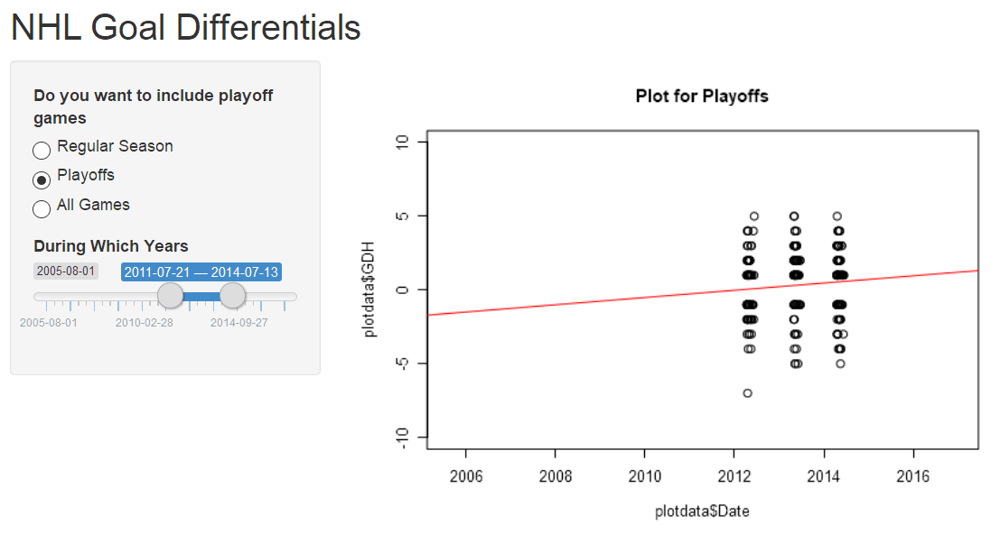

Data Products Week 4
========================================================
author: Joe Rosmus
date: 3/18/2018
autosize: true

Goal Differential
========================================================

Here is the shiny app

Here is the github repository housing the code


- In hockey, the team with the most goals scored is the winner
- There is a notion of having "Home field advantage"
- This tool will let us see how effective that is since 2005 when the shoot out was implemented.
- The shootout makes it so that no game can end in a tie.

More Explanation
=======================================================

- This app takes information from the  NHLData package.
- It plots the difference between goals scored by the home and away teams. So a positive value means the home team scored more than the away team.
- You can select a time frame to look at by using the variable slider.
- You can also delve deeper by choosing whether you want to see data for all games played, just the regular season, or just the playoffs.
- The red line shows the trend in goal differential over the selected time.


Slide With Code
========================================================
This code calculates the average goal differential for each season and stores them in a dataframe

```r
library(NHLData)
data(Sch0506,Sch0607,Sch0708)
GDH <- c(mean(Sch0506$GDH),mean(Sch0607$GDH),mean(Sch0708$GDH),mean(Sch0809$GDH),mean(Sch0910$GDH),mean(Sch1011$GDH),mean(Sch1112$GDH),mean(Sch1213$GDH),mean(Sch1314$GDH),mean(Sch1415),mean(Sch1516))
Year <-c(2005,2006,2007,2008,2009,2010,2011,2012,2013,2014,2015)

myNHL = data.frame(Year,GDH)
myNHL
```

```
   Year       GDH
1  2005 0.3008378
2  2006 0.3165523
3  2007 0.2653992
4  2008 0.3386484
5  2009 0.3282790
6  2010 0.1948446
7  2011 0.2857143
8  2012 0.3312655
9  2013 0.2728647
10 2014        NA
11 2015        NA
```

Slide With App
========================================================
Here is the information we can gather from the app shown below.

- During the chosen time teams were became more ffective at winning games on home ice in the playoffs.


